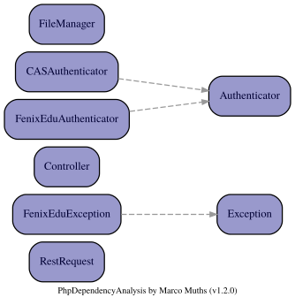

# FénixEdu Usage Example

Ever wanted to make a page using any data from [FénixEdu API](http://fenixedu.org/dev/api/)? You can use this example as a template. It requests your authorization to fetch your student data, showing a simple profile page with it.

## Limitations

There is a reported but unsolved bug that makes us unable to save authentication tokens under our student user spaces. You have 2 choices here:

- Use [CAS](https://suporte.dsi.tecnico.ulisboa.pt/tutorial/configurar-autenticacao-centralizada-em-paginas-web) if you only care about authenticating students;
- Use a student group space (i.e. a group in `/afs/ist.utl.pt/groups/`).

## Setup

In order to fetch FénixEdu data, first create your application at Fénix: `Personal > External Applications > Manage Applications > Create`

Take notice of the following fields:

- `Site`: https://fenix.tecnico.ulisboa.pt

This is the API endpoint, where your application will make requests.

- `Redirect URL`: https://EXAMPLE.tecnico.ulisboa.pt/index.php

`EXAMPLE` is the domain name set by your server.

This is the URL that will be loaded after a user has authenticated. If the domain isn't recognized by DSI, authentication will fail. Luckly for us, spaces in Sigma (technically Omega) are all allowed. Therefore, if you serve the page from a group space, it will look something like this:

```
https://groups.tecnico.ulisboa.pt/~GROUP.daemon/EXAMPLE/index.php
```

`GROUP` is your group name (for example `neiist`).
`EXAMPLE` is the path from the group's `web` directory to your application directory.

## Architecture

### Modules

NEIISTSDK is used to abstract FénixEdu handling. A class diagram is shown below:



From these modules, we use the following:

- `FenixEduAuthenticator`: Performs all the authentication boilerplate and abstracts data retrieval from the API.
- `Controller`: Templating of page html elements. If you have many pages with repeated elements, you can just define them once in a file, then append them dynamically in php;

### Credentials

Fénix will generate a client id and a client secret. These uniquely identify your application. Therefore, we'll add them to `settings.php`, which is read by `FenixEduAuthenticator`. Each setting corresponds to the following field in Fénix's application details:

- `access_key`: `Client Id`
- `secret_key`: `Client Secret`
- `callback_url`: `Redirect URL`
- `api_base_url`: `Site`

## Issues

If there's something missing or wrong in this tutorial, please leave an issue on GitHub.
